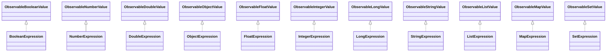
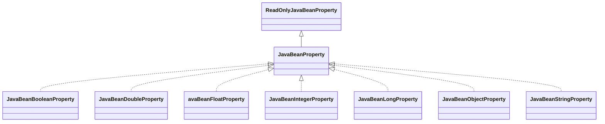

- [在IDEA中创建并运行JavaFX项目](#在idea中创建并运行javafx项目)
  - [方式一：IDEA提供的创建方式（推荐）](#方式一idea提供的创建方式推荐)
  - [方式二：手动创建](#方式二手动创建)
- [JavaFX核心思想](#javafx核心思想)
  - [生命周期和线程模型](#生命周期和线程模型)
  - [舞台（Stage）、场景（Scene）和场景图（Scene Graph）](#舞台stage场景scene和场景图scene-graph)
  - [JavaFX类型系统](#javafx类型系统)
    - [ObservableValue](#observablevalue)
    - [WritableValue](#writablevalue)
  - [属性](#属性)
    - [属性框架](#属性框架)
      - [ReadOnlyProperty和Property](#readonlyproperty和property)
      - [ReadOnlyJavaBeanProperty和JavaBeanProperty](#readonlyjavabeanproperty和javabeanproperty)
      - [集合框架](#集合框架)
      - [绑定属性](#绑定属性)
    - [属性实现](#属性实现)
      - [简单实现](#简单实现)
      - [包装器](#包装器)
      - [适配器](#适配器)
  - [监听器](#监听器)
    - [InvalidationListener和ChangeListener](#invalidationlistener和changelistener)
    - [WeakListener](#weaklistener)
  - [整体架构：MVVM](#整体架构mvvm)
- [FXML](#fxml)
  - [FXML标签](#fxml标签)
    - [类实例](#类实例)
      - [导入类](#导入类)
      - [通过标签创建](#通过标签创建)
      - [fx:value](#fxvalue)
      - [fx:factory](#fxfactory)
      - [构造器](#构造器)
      - [\<fx:include\>](#fxinclude)
      - [\<fx:constant\>](#fxconstant)
      - [\<fx:reference\>](#fxreference)
    - [实例属性](#实例属性)
      - [可读写属性](#可读写属性)
      - [只读列表属性](#只读列表属性)
      - [只读映射属性](#只读映射属性)
      - [默认属性](#默认属性)
    - [静态属性](#静态属性)
    - [定义代码块](#定义代码块)
  - [FXML属性](#fxml属性)
    - [实例属性](#实例属性-1)
      - [位置解析操作符](#位置解析操作符)
      - [变量解析操作符](#变量解析操作符)
      - [绑定表达式](#绑定表达式)
    - [静态属性](#静态属性-1)
    - [事件处理器属性](#事件处理器属性)
      - [脚本事件处理器](#脚本事件处理器)
      - [控制器方法事件处理器](#控制器方法事件处理器)
      - [表达式事件处理器](#表达式事件处理器)
      - [集合和属性的特殊处理程序](#集合和属性的特殊处理程序)
  - [脚本](#脚本)
  - [控制器](#控制器)
    - [@FXML](#fxml-1)
    - [嵌套的控制器](#嵌套的控制器)
  - [FXMLLoader](#fxmlloader)
- [CSS](#css)
  - [JavaFX默认样式表](#javafx默认样式表)
  - [Scene样式表](#scene样式表)
  - [布局组件样式表](#布局组件样式表)
  - [组件自身的CSS样式属性](#组件自身的css样式属性)
- [一个超级简单且全面的demo：计算器](#一个超级简单且全面的demo计算器)
- [场景和场景图](#场景和场景图)
  - [场景](#场景)
  - [场景图](#场景图)
    - [场景图布局机制](#场景图布局机制)
    - [节点自动调节大小的能力](#节点自动调节大小的能力)
  - [布局节点](#布局节点)
    - [Group](#group)
    - [Region](#region)
      - [水平布局（HBox）](#水平布局hbox)
      - [垂直布局（VBox）](#垂直布局vbox)
      - [浮动布局（FlowPane）](#浮动布局flowpane)
      - [网格布局（GridPane，TilePane）](#网格布局gridpanetilepane)
- [事件模型](#事件模型)
- [JavaFX CSS样式属性一览](#javafx-css样式属性一览)

# 在IDEA中创建并运行JavaFX项目

## 方式一：IDEA提供的创建方式（推荐）

创建完成之后直接运行即可：


## 方式二：手动创建

前置条件（必须）

- 电脑内有版本大于等于11（建议使用11或17长期支持版本）的jdk
- 环境变量JAVA_HOME设置的的jdk版本也要大于等于11

通过Maven原型创建项目：


如果在第四步中找不到对应原型需要手动添加：


接下来输入自己的项目信息：


编辑`archetypeArtifactId`，如果使用FXML就使用`javafx-archetype-fxml`，否则就使用`javafx-archetype-simple`。


之后再添加一个属性指定JavaFX的版本：


点击完成即可创建，创建后的项目结构如下：


pom文件如下:

```xml
<project xmlns="http://maven.apache.org/POM/4.0.0" xmlns:xsi="http://www.w3.org/2001/XMLSchema-instance"
  xsi:schemaLocation="http://maven.apache.org/POM/4.0.0 http://maven.apache.org/maven-v4_0_0.xsd">
    <modelVersion>4.0.0</modelVersion>
    <groupId>com.chinesecooly</groupId>
    <artifactId>learn-javafx</artifactId>
    <version>1.0-SNAPSHOT</version>
    <properties>
        <project.build.sourceEncoding>UTF-8</project.build.sourceEncoding>
        <maven.compiler.source>11</maven.compiler.source>
        <maven.compiler.target>11</maven.compiler.target>
    </properties>
    <dependencies>
        <dependency>
            <groupId>org.openjfx</groupId>
            <artifactId>javafx-controls</artifactId>
            <version>17.0.1</version>
        </dependency>
    </dependencies>
    <build>
        <plugins>
            <plugin>
                <groupId>org.apache.maven.plugins</groupId>
                <artifactId>maven-compiler-plugin</artifactId>
                <version>3.8.0</version>
                <configuration>
                    <release>11</release>
                </configuration>
            </plugin>
            <plugin>
                <groupId>org.openjfx</groupId>
                <artifactId>javafx-maven-plugin</artifactId>
                <version>0.0.6</version>
                <executions>
                    <execution>
                        <!-- Default configuration for running -->
                        <!-- Usage: mvn clean javafx:run -->
                        <id>default-cli</id>
                        <configuration>
                            <mainClass>com.chinesecooly.App</mainClass>
                        </configuration>
                    </execution>
                </executions>
            </plugin>
        </plugins>
    </build>
</project>
```

接下来使用compiler插件编译项目：


最后使用javafx插件运行项目：


运行结果如下：


# JavaFX核心思想

## 生命周期和线程模型

每个JavaFX应用都继承自`Application`类（子类必须声明为`public`，并且必须有一个公共的无参数构造函数）。当JavaFX应用启动时，会按顺序执行以下步骤：

- 启动JavaFX运行时环境。
- 构造`Application`类的实例。
- 执行`init()`方法。
- 执行 `start(javafx.stage.Stage)` 方法。
- 等待JavaFX应用程序完成，直到出现以下两种情况停止等待：
  - 调用`Platform.exit()`方法
  - 最后一个窗口关闭并且`implicitExit`属性为`true`
- 执行`stop()`方法。

一个简单的例子如下：

```java
public class HelloApplication extends Application {
    @Override
    public void start(Stage stage) throws IOException {
        FXMLLoader fxmlLoader = new FXMLLoader(HelloApplication.class.getResource("hello-view.fxml"));
        Scene scene = new Scene(fxmlLoader.load(), 320, 240);
        stage.setTitle("Hello!");
        stage.setScene(scene);
        stage.show();
    }

    public static void main(String[] args) {
        launch();
    }
}
```

在`main()`方法中调用了`launch()`方法，实际上JavaFX应用启动时的六个步骤就是由此方法发起的，通过分析源码得出以下线程模型：


## 舞台（Stage）、场景（Scene）和场景图（Scene Graph）

一个JavaFX应用由一个或多个Stage组成，一个Stage对应一个窗口。但一个JavaFX应用程序有一个主要的Stage（在执行 `start(javafx.stage.Stage)` 方法时由应用程序线程创建并传入）。要想在Stage上显示任何东西，就必须为其附加Scene，在运行时可以交换Stage的Scene，但一个Stage同一时间只能展示一个Scene。所有的视觉组件都要附加到Scene上展示，这些视觉组件被称为节点，所有附加到场景的节点总体被称为Scene Graph。


## JavaFX类型系统

和基本类型的包装类型类似，JavaFX有一套针对于Java原始类型的包装类型，包装类型分为以下两种：

- `ObservableValue`：它包装了一个可以被读取和监听的值。
- `WritableValue`：它包装了一个可以读取和设置的值。

### ObservableValue

它的继承结构如下：


这些包装子类和原始类型的关系如下：
|原始类型| 包装类 |
|--|--|
boolean|ObservableBooleanValue
double|ObservableDoubleValue
float|ObservableFloatValue
int|ObservableIntegerValue
long|ObservableLongValue
Double, Float, Integer, Long|ObservableNumberValue
Object|ObservableObjectValue
String|ObservableStringValue

`ObservableValue`接口提供了`getValue`方法用于获取获取包装类型的值，其子类接口提供了`get`方法用于获取原始类型的值。`ObservableValue`可以生成以下两种事件：

- 更改事件：更改事件指示值已经更改。
- 无效事件：无效事件指示当前值已经无效。

可以通过以下方法为`ObservableValue`添加和移除事件监听器：

```java
void addListener(InvalidationListener listener)
void addListener(ChangeListener<? super T> listener)
void removeListener(ChangeListener<? super T> listener)
void removeListener(InvalidationListener listener)
```

### WritableValue

它的继承结构如下：


这些包装子类和原始类型的关系如下：
|原始类型| 包装类 |
|--|--|
boolean|WritableBooleanValue
double|WritableDoubleValue
float|WritableFloatValue
int|WritableIntegerValue
long|WritableLongValue
Double, Float, Integer, Long|WritableNumberValue
Object|WritableObjectValue
String|WritableStringValue

与`ObservableValue`接口类似，`WritableValue`接口提供了`getValue`和`setValue`方法用于获取和设置包装类型的值，其子类接口提供了`get`和`set`方法用于获取和设置原始类型的值。

## 属性

每一个组件都有一些属性（成员变量），它们控制着组件的外观和行为，这些属性的类型不是简单的Java类型，而是基于JavaFX类型系统构建的包装类型。因此JavaFX类型系统是属性的基石。由于属性的重要性和复杂性，我将本节内容分为以下两部分：

- 属性框架：基于`ObservableValue`和`WritableValue`系列接口实现的属性框架，在实现上，属性框架只包含接口和抽象类。
- 属性实现：基于属性接口实现的实体类，可在开发中直接使用。

它们之间的关系如下：


谁也不能保证将来会不会再出来其它的类型框架和实现。此外，由于本节类和接口继承和实现的复杂性和重复性，本节所涉及的类图会详略得当，不会展示完整的继承关系并且会省略类似`XxxBase`的中间类。整体结构大致如下：


### 属性框架

#### ReadOnlyProperty和Property

`ReadOnlyProperty`是只读属性，它实现了`ObservableValue`接口，它的继承关系如下：


该接口提供了以下几个方法：

```java
//返回属性所在的对象，没有返回null
Object getBean()
//返回属性的名称，没有返回空字符串
String getName()
```

此外，一些实现子类还提供了以下几个方法：

```java
//创建一个ReadOnlyObjectProperty来保存这个ReadOnlyXxxProperty的值
ReadOnlyObjectProperty<Xxx> asObject()
//返回一个包装了ReadOnlyProperty的ReadOnlyXxxProperty
static ReadOnlyXxxProperty readOnlyXxxProperty(ReadOnlyProperty<Xxx> property)
```

`Property`是可读可写属性，它实现了`ReadOnlyProperty`和`WritableValue`接口，它的继承关系如下：


除了拥有`ReadOnlyProperty`所有功能外，所有`Property`都可以单向绑定到相同类型的`ObservableValue`，这意味着`Property`将始终包含与绑定的`ObservableValue`相同的值。还可以在两个`Property`之间定义双向绑定，以便两个属性始终包含相同的值。如果其中一个`Property`发生变化，另一个`Property`也会随之更新。该接口提供的方法如下：

```java
//绑定到相同类型的ObservableValue
void bind(ObservableValue<? extends T> observable)
//绑定到其他属性
void bindBidirectional(Property<T> other)
//检查该属性是否绑定了其它属性
boolean isBound()
//解除该属性的所有单向绑定
void unbind()
//解除该属性与参数属性的双向绑定
void unbindBidirectional(Property<T> other)
```

此外，一些实现子类还提供了以下几个方法：

```java
//创建一个双向绑定到该属性的ObjectProperty
ObjectProperty<Xxx> asObject()
//创建一个与参数双向绑定的XxxProperty
static XxxProperty xxxProperty(Property<Xxx> property)
```

#### ReadOnlyJavaBeanProperty和JavaBeanProperty

`ReadOnlyJavaBeanProperty`和`JavaBeanProperty`是充当常规Java Bean属性和相应JavaFX属性之间的适配器。其中：

- `ReadOnlyJavaBeanProperty`是只读JavaBean属性和只读JavaFX属性的适配器。
- `JavaBeanProperty`是可读写JavaBean属性和可读写JavaFX属性的适配器。

它们的继承结构如下：


#### 集合框架


集合框架没有对传统的Java集合实现类进行包装，而是直接继承了集合类的父接口（List，Map，Set），并且添加了三个默认方法：

```java
default SortedList<E> sorted()
default SortedList<E> sorted(Comparator<E> comparator)
default FilteredList<E> filtered(Predicate<E> predicate)
```

所以集合框架不再是一个包装类型框架，因此在使用集合框架时JavaFX为其提供了具体的实现，而这些实现由FXCollections静态工具类提供，并且此类还提供了一些常用方法，可自行查阅。

#### 绑定属性

绑定属性由一个或多个依赖项组装而成，绑定属性观察其依赖项的变化，并根据依赖项的变化更新自己的值。`Binding`是绑定属性的顶层接口，它的继承关系如下：




该接口提供的方法如下：

```java
void dispose()//销毁绑定属性
ObservableList<?> getDependencies()//返回绑定属性的依赖项
void invalidate()//将绑定属性值标记为无效。这将强制在下一次请求时重新计算绑定属性的值。
boolean isValid()//检查绑定属性是否是无效的
```

绑定属性可以通过两套API关联到它的依赖项：

- 低级API：使用繁琐，但功能强大、效率高。
- 高级API：使用简便，但功能缺失、效率低。

低级API的使用方式如下：

```java
DoubleBinding bindingTest = new DoubleBinding() {

    {
     //依赖项
        super.bind(a, b, c, d);
    }
 
 //绑定属性的计算方法
    @Override
    protected double computeValue() {
        return a.getValue() * b.getValue() + c.getValue() * d.getValue();
    }
};
```

而抽象属性的高级API由Bindings工具类提供（以BooleanBinding为例）：

```java
static BooleanBinding and(xxx)//绑定到与运算
static BooleanBinding booleanValueAt(xxx)//绑定到集合的一个值
static BooleanBinding createBooleanBinding(xxx)//帮助函数，用于创建自定义布尔绑定。
static BooleanBinding equal(xxx)//绑定一个判等运算
static BooleanBinding notEqual(double op1, ObservableNumberValue op2, double epsilon)//绑定一个不等运算
static BooleanBinding greaterThan(xxx)//绑定一个大于运算
static BooleanBinding greaterThanOrEqual(xxx)//绑定一个大于等于运算
static BooleanBinding isEmpty(xxx)//绑定一个判空运算
static <K,V> BooleanBinding isNotEmpty(xxx)//绑定一个非空运算
static BooleanBinding isNull(ObservableObjectValue<?> op)//绑定一个判null运算
static BooleanBinding isNotNull(ObservableObjectValue<?> op)//绑定一个非null运算
static BooleanBinding lessThan(double op1, ObservableNumberValue op2)//绑定一个小与运算
static BooleanBinding lessThanOrEqual(double op1, ObservableNumberValue op2)//绑定一个小于等于运算
static BooleanBinding not(ObservableBooleanValue op)//绑定一个非运算
static BooleanBinding selectBoolean(Object root, String... steps)//绑定到判断成员是否存在
```

### 属性实现

#### 简单实现

所谓简单实现就是形如`SimpleXxxProperty`的实现类，它们的继承结构如下：


这些实现一般有以下几个构造方法：

```java
SimpleXxxProperty()
SimpleXxxProperty(Xxx initialValue)
SimpleXxxProperty(Object bean, String name)
SimpleXxxProperty(Object bean, String name, Xxx initialValue)
```

#### 包装器

所谓包装器就是形如`ReadOnlyXxxWrapper`的实现类，它们的继承结构如下：


当实例化一个包装器类时，实际上它创建了两个同步的属性：

- 只读属性：可以传递给外部用户。
- 可读写属性（自身）：应该只在内部使用。该接口提供

包装器的只读属性可以通过它提供的方法获取：

```java
ReadOnlyXxxProperty getReadOnlyProperty()
```

包装器类一般有以下几个构造方法：

```java
ReadOnlyXxxWrapper()
ReadOnlyXxxWrapper(Xxx initialValue)
ReadOnlyXxxWrapper(Object bean, String name)
ReadOnlyXxxWrapper(Object bean, String name, Xxx initialValue)
```

#### 适配器

`ReadOnlyJavaBeanBooleanProperty`实现类的继承结构如下：


`JavaBeanProperty`实现类的继承结构如下：




对于适配器适配的Java Bean类，必须实现适配属性声明为public的Getter和Setter。如果Java Bean属性支持PropertyChangeListeners，那么适配器将意识到Java Bean属性的变化。否则，必须通过调用适配器的`fireValueChangedEvent`方法来通知它有关更改。实现类提供的方法如下：

```java
//向JavaFX属性发出信号，表示它将不再被使用，并且可以删除任何引用。
void dispose()
//向所有附加的InvalidationListeners和changelistener发送通知。如果此属性的值发生变化，则需要调用此方法。
void fireValueChangedEvent()
```

值得注意的是不能直接创建适配器，必须通过`JavaBeanXxxPropertyBuilder`形式的建造者创建：


```mermaid
classDiagram
 class JavaBeanBooleanPropertyBuilder
 class JavaBeanDoublePropertyBuilder
 class JavaBeanFloatPropertyBuilder
 class JavaBeanIntegerPropertyBuilder
 class JavaBeanLongPropertyBuilder
 class JavaBeanObjectPropertyBuilder
 class JavaBeanStringPropertyBuilder
```

建造者提供的方法如下：

```java
//创建XxxBuilder实例
static XxxBuilder create()
//设置属性的名称。
XxxBuilder name(String name)
//设置适配器应该连接到的Java Bean实例。
XxxBuilder bean(Object bean)
//设置应该在其中搜索getter和setter的Java Bean类。
XxxBuilder beanClass(Class<?> beanClass)
//使用当前设置生成一个新的XxxProperty。
XxxProperty build()
//设置setter方法。
XxxBuilder setter(Method setter)
XxxBuilder setter(String setter)
//设置getter方法
XxxBuilder getter(Method getter)
XxxBuilder getter(String getter)
```

建造者的使用步骤如下：

- 调用`create`方法生成一个建造者实例
- 必须使用`name`方法指定属性的名称。
- 如果属性的Getter和Setter不符合命名规范，则必须指明属性的Getter和Setter方法。
- 如果要为某一个实例的属性生成适配器，则使用`bean`方法指定实例。
- 如果要为某一个类的多个实例生成适配器，则使用`beanClass`方法指定类。
- 最后使用`build`方法生成适配器。

## 监听器

### InvalidationListener和ChangeListener

JavaFX中共有以下两种监听器：

- 失效监听器（`InvalidationListener`）：监听值是否无效。
- 变更监听器（`ChangeListener`）：监听值是否更改。

它们的继承关系如下：

```mermaid
classDiagram
 class InvalidationListener{<<interface>>}
 class ChangeListener{<<interface>>}
 class ArrayChangeListener{<<interface>>}
 class ListChangeListener{<<interface>>}
 class MapChangeListener{<<interface>>}
 class SetChangeListener{<<interface>>}
```

每当被监听的`ObservableValue`值变为无效时，就会调用`InvalidationListener`的`invalidated`方法。一个`InvalidationListener`可以监听多个`ObservableValue`。

```java
void invalidated(Observable observable)//
```

每当被监听的`ObservableValue`的值发生变化时，就会调用`ChangeListener`的`changed`方法。一个`ChangeListener`可以监听多个`ObservableValue`。

```java
void changed(ObservableValue<? extends T> observable, T oldValue, T newValue)/
```

### WeakListener

值得注意的是`InvalidationListener`和`ChangeListener`均是函数式接口，没有具体的实现，可以通过Lambda表达式和内部内的方式创建它们。但不建议直接将他们作为`ObservableValue`的监听器，而应该使用`WeakListener`进行包装，这有助于避免内存泄漏。每个`WeakListener`实现类是通过传入原始监听器来创建的。`WeakListener`继承结构如下：

```mermaid
classDiagram
 class InvalidationListener{<<interface>>}
 class ChangeListener{<<interface>>}
 class WeakChangeListener{<<final class>>}
 InvalidationListener<|..WeakInvalidationListener
 WeakListener<|..WeakInvalidationListener
 ChangeListener<|..WeakChangeListener
 WeakListener<|..WeakChangeListener
 class ListChangeListener{<<interface>>}
 class MapChangeListener{<<interface>>}
 class SetChangeListener{<<interface>>}
 class WeakListChangeListener{<<final class>>}
 class WeakMapChangeListener{<<final class>>}
 class WeakSetChangeListener{<<final class>>}
 ListChangeListener<|..WeakListChangeListener
 MapChangeListener<|..WeakMapChangeListener
 SetChangeListener<|..WeakSetChangeListener
 WeakListener<|..WeakListChangeListener
 WeakListener<|..WeakMapChangeListener
 WeakListener<|..WeakSetChangeListener
```

## 整体架构：MVVM


# FXML
>
>原文链接：<https://openjfx.cn/javadoc/18/javafx.fxml/javafx/fxml/doc-files/introduction_to_fxml.html>

FXML是一种可编写的、基于XML的用于构造JavaFX场景图的标记语言。在FXML中，一个FXML标签代表以下类型之一：

- 某个类的实例
- 某个类实例的属性
- 某个静态属性
- 一个定义代码块
- 一个脚本代码块

一个FXML属性表示以下类型之一：

- 某个类实例的属性
- 某个静态属性
- 事件处理程序

## FXML标签

### 类实例

#### 导入类

要想在FXML使用Java类，必须使用以下语句进行导入：

```xml
<?import javafx.scene.control.Label?>
```

#### 通过标签创建

在FXML中创建实例最简单的方法是通过FXML元素。任何遵循JavaBean构造函数和属性命名约定的类都可以通过此方式创建实例。

```xml
<?import javafx.scene.control.Label?>
<Label text="Hello world FXML"/>
```

#### fx:value

`fx:value`属性可以用来实例化没有默认构造函数但提供静态`valueOf(String)`方法的类：

```xml
<String fx:value="Hello, World!"/>
```

#### fx:factory

`fx:factory`属性可以使用静态工厂方法实例类：

```xml
<FXCollections fx:factory="observableArrayList">
    <String fx:value="A"/>
    <String fx:value="B"/>
    <String fx:value="C"/>
</FXCollections>
```

#### 构造器

构造器可以用于实例化不符合JavaBean约定的类，FXML中的构造器支持由两个接口提供：

- `javafx.util.Builder`接口定义了一个名为`build()`的方法，它负责构造实际的对象：

```java
public interface Builder<T> {
    public T build();
}
```

- `javafx.util.BuilderFactory`接口负责生成能够实例化给定类型的构造器：

```java
public interface BuilderFactory {
    public Builder<?> getBuilder(Class<?> type);
}
```

JavaFX中提供了一个默认的构建器工厂`JavaFXBuilderFactory`,这个工厂能够创建和配置大多数不可变的JavaFX类型：

```xml
<Color red="1.0" green="0.0" blue="0.0"/>
```

构建器构造的对象直到到达元素的结束标记时才会实例化。这是因为在元素被完全处理之前，所有必需的参数可能都不可用。

#### &lt;fx:include>

`<fx:include>`标签可以从另一个文件中定义的FXML标签实例化对象：

```xml
<fx:include source="filename"/>
```

`<fx:include>`标签还支持用于指定应用于本地化所包含内容的资源包名称的属性，以及用于编码源文件的字符集：

```xml
<fx:include source="filename" resources="resource_file" charset="utf-8"/>
```

#### &lt;fx:constant>

`<fx:constant>`标签用于创建对类常量的引用：

```xml
<Button>
    <minHeight>
     <Double fx:constant="NEGATIVE_INFINITY"/>
    </minHeight>
</Button>
```

#### &lt;fx:reference>

`<fx:reference>`标签可以创建对现有实例的引用：

```xml
<ImageView>
    <image>
        <fx:reference source="myImage"/>
    </image>
</ImageView>
```

### 实例属性

属性标签可以表示以下几种形式之一：

- 可读写属性
- 只读列表属性
- 只读映射属性

#### 可读写属性

如果属性元素表示的是可读写属性，那么属性元素的内容将作为可读写属性的Setter的参数值传递：

```xml
<?import javafx.scene.control.Label?>
<Label>
    <text>Hello, World!</text>
</Label>
```

#### 只读列表属性

只读列表属性的Getter返回`java.util.List`的一个实例，并且没有相应的Setter方法。只读列表元素的内容在处理时自动添加到列表中：

```xml
<VBox>
 <children>
  <Label>
      <text>line 1</text>
  </Label>
  <Label>
      <text>line 2</text>
  </Label>    
 </children>
</VBox>
```

#### 只读映射属性

只读映射属性的Getter返回`java.util.Map`的一个实例，并且没有相应的Setter方法。只读映射元素的属性在处理结束标记时应用于映射。

```xml
<Button>
    <properties foo="123" bar="456"/>
</Button>
```

#### 默认属性

JavaFX组件可以有一个默认属性。这意味着，如果FXML元素包含没有嵌套在属性元素中的子元素，则假定这些子元素属于默认属性。比如上文中的`<vBox>`完全可以改写成以下形式：

```xml
<VBox>
 <Label>
     <text>line 1</text>
 </Label>
 <Label>
     <text>line 2</text>
 </Label>    
</VBox>
```

JavaFX组件的默认属性使用注释`@DefaultProperty(value="propertyName")`进行标记。

### 静态属性

静态属性是只有在特定上下文中才有意义的属性，因为它们不是应用到的类的固有属性，而是由另一个类（通常是控件的父容器）定义的。静态属性以定义它们的类的名称作为前缀来使用：

```xml
<GridPane>
 <Label>
     <text>my label</text>
  <GridPane.rowIndex>0</GridPane.rowIndex>
  <GridPane.columnIndex>0</GridPane.columnIndex>
 </Label>
</TabPane>
```

### 定义代码块

`<fx:define>`元素用于创建存在于场景图之外但可能需要在其它地方引用的对象。例如，在处理单选按钮时，通常需要定义一个`ToggleGroup`来管理按钮的选择状态。这个组不是场景图本身的一部分，所以不应该添加到按钮的父节点。定义块可以用来创建按钮组，而不影响文档的整体结构：

```xml
<VBox>
    <fx:define>
        <ToggleGroup fx:id="myToggleGroup"/>
    </fx:define>
    <children>
        <RadioButton text="A" toggleGroup="$myToggleGroup"/>
        <RadioButton text="B" toggleGroup="$myToggleGroup"/>
        <RadioButton text="C" toggleGroup="$myToggleGroup"/>
    </children>
</VBox>
```

## FXML属性

### 实例属性

FXML属性也可以用来配置实例的属性：

```xml
<?import javafx.scene.control.*?>
<Button text="Click Me!"/>
```

当属性值是复杂类型，不能使用简单的基于字符串的FXML属性表示时，或者值的字符长度太长，以至于将其指定为FXML属性会对可读性产生负面影响时，通常使用属性标签。FXML属性和属性标签一个区别在于FXML属性必须在各自标签到达结束标签时才会起作用，另一个区别在于FXML属性支持可以扩展其功能的操作符，支持的操作符如下：

- 位置解析操作符
- 资源解析操作符
- 变量解析操作符
- 绑定表达式

#### 位置解析操作符

位置解析操作符（属性值前加前缀`@`）用于指定属性值应被视为相对于当前文件的URL（URL中的空白值必须经过编码），而不是一个简单的字符串：

```xml
<ImageView>
    <image>
        <Image url="@my_image.png"/>
    </image>
</ImageView>
```

#### 变量解析操作符

FXML文档定义了一个变量名称空间，在这个名称空间中，变量可以被唯一的标识。如果将`fx:id`属性值赋给标签，那么将在文档的名称空间中创建一个变量，变量解析操作符（在属性值前面加前缀`$`）允许调用者在调用相应的Setter方法之前，将标签的属性值替换为指定变量的实例：

```xml
<fx:define>
    <ToggleGroup fx:id="myToggleGroup"/>
</fx:define>
<RadioButton text="A" toggleGroup="$myToggleGroup"/>
<RadioButton text="B" toggleGroup="$myToggleGroup"/>
<RadioButton text="C" toggleGroup="$myToggleGroup"/>
```

#### 绑定表达式

绑定表达式（将属性值使用`${}`包裹）可以将属性的值绑定到其它属性上，这样当被绑定的属性值变化时，绑定的属性值也会变化：

```xml
<TextField fx:id="textField"/>
<Label text="${textField.text}"/>
```

绑定表达式支持的数据类型如下：

- 字符串
- 数字
- 布尔

绑定表达式支持的运算符如下：

- +、-、*、/
- &&、||、!
- \>、>=、<、<=
- ==、!=

### 静态属性

FXML属性表示的静态属性和FXML标签表示的类似：

```xml
<GridPane>
    <children>
        <Label text="My Label" GridPane.rowIndex="0" GridPane.columnIndex="0"/>
    </children>
</TabPane>
```

区别在于FXML属性表示的静态属性支持功能性操作符（绑定表达式除外）。

### 事件处理器属性

事件处理器属性是将事件处理器附加到FXML元素的一种方便方法，FXML支持三种类型的事件处理程序：

- 脚本事件处理器
- 控制器方法事件处理器
- 表达式事件处理器

#### 脚本事件处理器

脚本事件处理程序是在事件触发时执行脚本代码的事件处理程序：

```xml
<?language javascript?>

<VBox>
    <children>
        <Button text="Click Me!" onAction="java.lang.System.out.println('You clicked me!');"/>
    </children>
</VBox>
```

注意在代码片段开始时使用语言处理指令。这个指令告诉FXML加载程序应该使用脚本语言来执行事件处理程序。若要关闭脚本代码的自动编译，请放置处理指令`<?compile false?>`在包含脚本的标签的前面。若要再次启动脚本代码编译，请使用`<?compile true?>`。

#### 控制器方法事件处理器

控制器方法事件处理器是由FXML文档的控制器定义的方法：

```xml
<VBox fx:controller="com.foo.MyController"
    xmlns:fx="http://javafx.com/fxml">
    <children>
        <Button text="Click Me!" onAction="#handleButtonAction"/>
    </children>
</VBox>
```

通常情况下，事件处理器应该接受一个扩展自`javafx.event.Event`类型的单一参数，并返回`void`，当然，参数也可以省略。

```java
package com.foo;

public class MyController {
    public void handleButtonAction(ActionEvent event) {
        System.out.println("You clicked me!");
    }
}
```

#### 表达式事件处理器

指向`javafx.event.EventHandler`类型的任何表达式都可以用作表达式处理程序：

```xml
<VBox fx:controller="com.foo.MyController"
    xmlns:fx="http://javafx.com/fxml">
    <children>
        <Button text="Click Me!" onAction="$controller.onActionHandler"/>
    </children>
</VBox>
```

```java
public class MyController {

    @FXML
    public EventHandler<ActionEvent> onActionHandler = new EventHandler<>() { ... }

}
```

注意，其他类型的表达式，如绑定表达式，在此上下文中不受支持。

#### 集合和属性的特殊处理程序

不能使用`setOnEvent`方法监听集合的变化，因此，`ObservableList`,、`ObservableMap`和`ObservableSet` 使用一个特殊的`onChange`属性，该属性指向带有 `ListChangeListener.Change`、`MapChangeListener.Change`、和 `SetChangeListener.Change`参数的处理方法。

```xml
<VBox fx:controller="com.foo.MyController"
    xmlns:fx="http://javafx.com/fxml">
    <children onChange="#handleChildrenChange"/>
</VBox>
```

处理器方法如下：

```java
package com.foo;

import javafx.collections.ListChangeListener.Change;

public class MyController {
    public void handleChildrenChange(ListChangeListener.Change c) {
        System.out.println("Children changed!");
    }
}
```

也不能使用`setOnEvent`方法监听属性的变化，要注册到一个属性，必须使用一个特殊的`on<propertyName>Change`属性：

```xml
<VBox fx:controller="com.foo.MyController"
    xmlns:fx="http://javafx.com/fxml" onParentChange="#handleParentChange"/>
```

处理器方法如下：

```java
public class MyController {
    public void handleParentChange(ObservableValue value, Parent oldValue, Parent newValue) {
        System.out.println("Parent changed!");
    }
}
```

## 脚本

`<fx:script>`标记允许将脚本代码导入或嵌入FXML文件中。可以使用任何JVM脚本语言编写脚本。如果脚本引擎实现了`javax.script.Compilable`接口，那么脚本在第一次加载时将被默认编译。如果编译失败，`FXMLLoader`将退回到解释模式。

- 使用脚本的第一种方式是将脚本嵌入到关联的标签中：

```xml
<?language javascript?>

<?import javafx.scene.control.*?>
<?import javafx.scene.layout.*?>

<VBox xmlns:fx="http://javafx.com/fxml">
    <fx:script>
    function handleButtonAction(event) {
       java.lang.System.out.println('You clicked me!');
    }
    </fx:script>

    <children>
        <Button text="Click Me!" onAction="handleButtonAction(event);"/>
    </children>
</VBox>
```

- 使用脚本更常用的方式是引入外部的脚本文件：

```xml
<?language javascript?>

<?import javafx.scene.control.*?>
<?import javafx.scene.layout.*?>

<VBox xmlns:fx="http://javafx.com/fxml">
    <fx:script source="example.js" charset="cp1252"/>

    <children>
        <Button text="Click Me!" onAction="handleButtonAction(event);"/>
    </children>
</VBox>
```

```js
//example.js
function handleButtonAction(event) {
   java.lang.System.out.println('You clicked me!');
}
```

## 控制器

虽然在脚本中编写简单的事件处理程序很方便，但通常更可取的做法是在编译后的强类型语言中定义更复杂的应用程序逻辑。如前所述，`fx:controller`属性允许将控制器类与FXML文档关联起来。控制器是一个编译类，它实现了文档定义的对象层次结构的背后代码。这个属性包含控制器类全类名。该类的一个实例在加载FXML文件时创建，因此控制器类必须有一个无参数的构造函数。

```xml
<VBox fx:controller="com.foo.MyController"
    xmlns:fx="http://javafx.com/fxml">
    <children>
        <Button text="Click Me!" onAction="#handleButtonAction"/>
    </children>
</VBox>
```

```java
package com.foo;

public class MyController {
    public void handleButtonAction(ActionEvent event) {
        System.out.println("You clicked me!");
    }
}
```

在许多情况下，以这种方式简单地声明事件处理程序就足够了。然而，当需要对控制器及其管理的元素的行为进行更多的控制时，控制器可以定义一个`initialize()`方法，当其关联文档的内容被完全加载后，该方法将在实现控制器上调用:

```java
public void initialize();
```

可以将FXML文件中的JavaFX组件绑定到控制器类中的字段，前提是需要为JavaFX组件的FXML元素提供一个`fx:id`属性，该属性具有要绑定的控制器字段的名称作为值。

```java
public class MyFxmlController {

    public Label label;

}
```

```xml
<VBox  xmlns:fx="http://javafx.com/fxml" >
    <Label fx:id="label" text="Line 1"/>
</VBox>
```

### @FXML

注意，在前面的示例中，控制器成员字段和事件处理程序方法被声明为公共的，因此可以由加载器设置或调用它们。但是，对于那些喜欢限制控制器字段或处理程序方法可见性的开发人员，可以使用`@FXML`注解。这个注解将一个受保护的或私有的类成员标记为FXML可访问的。

### 嵌套的控制器

通过`<fx:include>`标签加载的嵌套FXML文档的控制器实例被直接映射到包含控制器的成员字段。例如，给定以下代码:

```xml
<VBox fx:controller="com.foo.MainController">
   <fx:define>
      <fx:include fx:id="dialog" source="dialog.fxml"/>
   </fx:define>
</VBox>
```

```java
public class MainController extends Controller {
    @FXML private Window dialog;
    @FXML private DialogController dialogController;
}
```

当调用控制器的`initialize`方法时，dialog字段将包含从dialog.fxml中加载的根元素，dialogController字段将包含包含dialog对象的控制器。

## FXMLLoader

`FXMLLoader`类负责实际加载FXML源文件并返回结果对象图。

```java
URL location = getClass().getResource("example.fxml");
ResourceBundle resources = ResourceBundle.getBundle("com.foo.example");
FXMLLoader fxmlLoader = new FXMLLoader(location, resources);

Pane root = (Pane)fxmlLoader.load();
MyController controller = (MyController)fxmlLoader.getController();
```

在加载时，`FXMLLoader`使用`com.sun.javafx.fxml.BeanAdapter`的一个实例来包装一个实例化的对象，并调用它的Setter方法。这个私有类实现了`java.util.Map`接口，并允许调用者以键值对的形式获取和设置Bean属性值。如果一个元素表示一个已经实现了`Map`的类型，它不会被包装，它的`get`和`put`方法会被直接调用。

# CSS
>
>原文链接：<https://openjfx.cn/javadoc/18/javafx.graphics/javafx/scene/doc-files/cssref.html>

JavaFX允许使用CSS样式修饰JavaFX组件，JavaFX使用与Web CSS相同的CSS语法，但CSS属性是特定于JavaFX的，因此与Web对应的名称略有不同。除了少数例外，JavaFXCSS属性名的前缀是`-fx-`。CSS样式应用于JavaFX场景图中的节点，其方式类似于CSS样式应用于HTML DOM中的元素。样式首先应用于父类，然后应用于其子类。CSS选择器用于将样式与场景图节点相匹配。Node和CSS选择器的关系如下:

- Node的getTypeSelector方法返回一个String，类似于CSS类型选择器。默认情况下，此方法返回类的简单名称。注意，内部类或匿名类的简单名称可能不能用作类型选择器。在这种情况下，应该重写此方法以返回有意义的值。
- 场景图中的每个节点都有一个styleClass属性。注意，一个节点可能有多个样式类。Node的styleClass类似于可以出现在HTML元素上的class="…"属性。
- 场景图中的每个节点都有一个id变量，一个字符串。这类似于可以出现在HTML元素中的id="…"属性。

## JavaFX默认样式表

JavaFX应用程序有一个默认的CSS样式表，它应用于所有的JavaFX组件。如果不提供组件的样式，默认的CSS样式表将对JavaFX组件进行样式设置。

## Scene样式表

可以为JavaFX场景对象设置CSS样式表，这个样式表被应用于所有添加到场景图中的JavaFX组件。Scene样式表中指定的样式优先于默认样式表中指定的样式。

```java
scene.getStylesheets().add("style1/button-styles.css");
```

## 布局组件样式表

在所有布局组件上也可以设置样式表，这个样式表应用于包含在布局组件内的所有组件，布局组件样式表指定的CSS样式通常优先于Scene样式表中指定的CSS样式。

```java
Button button1 = new Button("Button 1");
Button button2 = new Button("Button 2");
VBox vbox = new VBox(button1, button2);
vbox.getStylesheets().add("style1/button-styles.css");
```

## 组件自身的CSS样式属性

可以通过在组件上直接设置CSS样式属性来设置组件的CSS样式，
此方式设置的样式优先于布局组件样式表中指定的样式。

```java
Button button = new Button("Button 2");
button.setStyle("-fx-background-color: #0000ff");
```

# 一个超级简单且全面的demo：计算器

项目地址：[FX计算器](https://github.com/chinesecooly/fx-calculator-.git)


# 场景和场景图

## 场景

`Scene`定义了要渲染的场景，它定义的内容包括：

- 场景背景填充。
- 场景大小。
- 要渲染到场景上的根节点序列。
- ...

其中最重要的是根节点序列，这个根节点序列是这个场景的场景图。
|类型| 属性 |说明
|--|--|--
|

## 场景图

场景图是一个由节点组成的树形结构，`Node`是场景图节点的基类，它的继承结构如下：

```mermaid
classDiagram
 class Node{<<abstract class>>}
 class Parent{<<abstract class>>}
 class Group{<<class>>}
 class Region{<<class>>}
 class WebView{<<final class>>}
 class Camera{<<abstract class>>}
 class Canvas{<<class>>}
 class ImageView{<<class>>}
 class LightBase{<<abstract class>>}
 class MediaView{<<class>>}
 class Shape{<<abstract class>>}
 class Shape3D{<<abstract class>>}
 class SubScene{<<class>>}
 Node <|--Parent
 Parent<|--Group
 Parent<|--Region
 Parent<|--WebView
 Node <|--Camera
 Node <|--Canvas
 Node <|--ImageView
 Node <|--LightBase
 Node <|--MediaView
 Node <|--Shape
 Node <|--Shape3D
 Node <|--SubScene
```

场景图中的节点分为两类：

- 分支节点：`Parent`及其实现类。
- 叶子节点：除分支节点的外的其它节点，或者其它不能有子类的叶子类。每个场景图树中只有一个节点没有父节点，这个节点被称为“根”节点。

节点的限制如下：

- 一个节点在场景图中只能出现一次，如果一个程序向分支点添加了一个子节点，并且该子节点已经是其它分支节点的子节点或场景的根节点，则该节点将自动从其前父节点中移除。
- 节点之间不能存在循环结构。

节点的通用设计如下：


节点的属性如下：
|类型| 属性 |说明
|--|--|--

### 场景图布局机制

一旦应用程序创建并显示场景，场景图形布局机制将由系统自动驱动。场景图检测影响布局的动态节点更改并调用`requestLayout`方法，这将该分支标记为需要布局，以便在下一个脉冲中，通过调用该分支根上的`layout`方法在该分支上执行自上而下的布局传递。在布局过程中，将在每个父节点上调用`layoutChildren`回调方法来布局其子节点。该机制旨在通过确保多个布局请求在一次传递中合并和处理，而不是在每分钟更改一次时执行重新布局，从而最大化布局效率。因此，应用程序不应该在节点上直接调用布局。

### 节点自动调节大小的能力

场景图形支持可调整大小和不可调整大小的节点类。`Node`上的`isResizable`方法返回给定节点是否可调整大小。可调整大小的节点类支持可接受的大小范围（最小<=首选<=最大），允许其父节点在布局期间根据其父节点自己的布局策略和兄弟节点的布局需求在该范围内调整其大小。不可调整大小的节点类没有一致的调整大小API，因此在布局期间它们的父类不会调整其大小。应用程序必须通过在每个实例上设置适当的属性来确定不可调整大小的节点的大小。

## 布局节点

布局节点内可以嵌套其它节点（控件节点和布局节点）。一旦其它节点被添加进来，布局节点将自动管理它门的布局，所以应用程序不应该直接定位或调整这些节点的大小。`Parent`是布局节点的基类，它的继承结构如下：

```mermaid
classDiagram
 class Parent{<<abstract class>>}
 class Group{<<class>>}
 class Region{<<class>>}
 class Pane{<<class>>}
 class HBox{<<class>>}
 class AnchorPane{<<class>>}
 class FlowPane{<<class>>}
 class GridPane{<<class>>}
 class StackPane{<<class>>}
 class TilePane{<<class>>}
 class VBox{<<class>>}
 Parent<|--Group
 Parent<|--Region
 Region<|--Pane
 Pane<|--HBox
 Pane<|--AnchorPane
 Pane<|--FlowPane
 Pane<|--GridPane
 Pane<|--StackPane
 Pane<|--TilePane
 Pane<|--VBox
```

|类型| 属性 |说明
|--|--|--

### Group

`Group`布局节点的特点如下：

- 按加入的顺序呈现子节点。
- 不可以直接调节大小。
- 没有自己的边界，将采用其子节点的集体边界。
- 应用于`Group`的任何转换、效果或状态都将应用于其子节点。

|类型| 属性 |说明
|--|--|--

### Region

`Region`布局节点的特点如下：

- 可以直接调节大小。
- 拥有自己的边界，默认表现为直角矩形。
- 可应用CSS，且应用于`Region`的样式都将应用于其子节点。

|类型| 属性 |说明
|--|--|--

#### 水平布局（HBox）

#### 垂直布局（VBox）

#### 浮动布局（FlowPane）

#### 网格布局（GridPane，TilePane）

# 事件模型

JavaFX事件模型的继承结构如下：

```mermaid
classDiagram
 class Event{<<class>>}
 class ActionEvent{<<class>>}
 class  EventType{<<final class>>}
 class EventTarget{<<interface>>}
 class EventHandler{<<interface>>}
 class WeakEventHandler{<<final class>>}
 class EventDispatcher{<<interface>>}
 class EventDispatchChain{<<interface>>}
 Event<|--ActionEvent
 EventHandler<|..WeakEventHandler
```

`Event`是JavaFX事件模型的顶级接口，在该接口中定义了一些事件的通用属性和方法：

```java
//所有事件类型的通用超类型。
static final EventType<Event> ANY
//将此事件标记为已使用
void consume()
//使用指定的事件源和目标创建并返回此事件的副本。
Event copyFor(Object newSource, EventTarget newTarget)
//触发指定事件
static void fireEvent(EventTarget eventTarget, Event event)
//获取事件类型
EventType<? extends Event> getEventType()
//获取事件目标
EventTarget getTarget()
//该事件是否被使用
boolean isConsumed()
```

每一个事件都关联着一个事件来源、事件类型（`EventType`）和事件目标（`EventTarget`）。事件来源是注册事件处理器（`EventHandler`）并将事件发送给处理器的对象。

```java
//EventHandler中的方法
void handle(T event)/特定类型事件的处方法
```

事件类型为事件提供了分类，所有的事件类型形成一个以`Event.ANY`为根的层次结构。基于这个层次结构，事件处理器可以注册一个超级事件类型，并接收它的子类型事件。（注意，不能构造两个具有相同名称和父类的不同`EventType`对象）

```java
//返回事件类型的名称
final String getName()
//返回事件类型的超类型
final EventType<? super T> getSuperType()
```

事件目标（`EventTarget`）定义了事件发布时所经过的路径（`EventDispatchChain`）：

```java
//为此目标构造事件分发链。
EventDispatchChain buildEventDispatchChain(EventDispatchChain tail)
```

`EventDispatchChain`可以将事件从一个事件调度器（`EventDispatcher`）传递到链中的下一个事件调度器。并且可以添加其它事件调度器到此链中。

```java
//通过EventDispatchChain分派指定的事件。
Event dispatchEvent(Event event)
//将指定的事件调度器追加到此链。
EventDispatchChain append(EventDispatcher eventDispatcher)
//将指定的事件调度器前置到此链。
EventDispatchChain prepend(EventDispatcher eventDispatcher)
```

`EventDispatcher`可以将事件通过指定的`EventDispatchChain`分派给关联的`EventTarget`。一个事件处理器可以出现在多个事件处理器链中。

```java
Event dispatchEvent(Event event, EventDispatchChain tail)
```

事件处理框架定义了事件交付的两个阶段。第一个阶段称为捕获阶段，当事件从与`EventTarget`关联的`EventDispatchChain`的第一个元素传递到最后一个元素时发生。第二阶段被称为冒泡阶段，其发生顺序与第一阶段相反。

# JavaFX CSS样式属性一览


<script type="module">
import mermaid from 'https://cdn.jsdelivr.net/npm/mermaid@10.0.2/+esm';
mermaid.initialize({ startOnLoad: false });
await mermaid.run({
  querySelector: '.language-mermaid',
});
</script>

